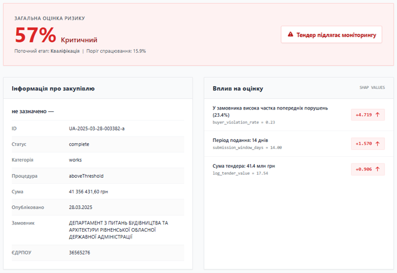
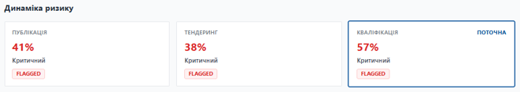

# prozorro-risk-scorer

> ML-powered corruption risk assessment for Ukrainian public procurement tenders

A machine learning system that predicts the probability of a corruption-related violation in a public tender using open data from the [Prozorro](https://prozorro.gov.ua) procurement system. The system explains every prediction with human-readable risk factors derived from SHAP values.




---

## How it works

1. User submits a tender ID (OCID, UUID, or full Prozorro URL)
2. Backend fetches tender data from the Prozorro open API in real time
3. Features are extracted and passed to the appropriate risk model (M1 / M2 / M3)
4. A calibrated risk probability + SHAP-based explanation is returned
5. Frontend displays the score, risk level, key factors and stage-by-stage timeline

### Three-stage model architecture

| Model | Tender stage | Features |
|-------|-------------|----------|
| M1 | Announcement | 19 — procedural, financial, historical |
| M2 | Bidding period | 20 — M1 + enquiry activity |
| M3 | Completed | 31 — M2 + post-auction features |

The model is automatically selected based on the current tender status.

---

## Results

Evaluated on 292,319 competitive tenders (Jan 2025+) with a separate certified subset of 4,962 DASU-monitored tenders:

| Model | PR-AUC (full) | PR-AUC (DASU) | Precision (DASU) |
|-------|--------------|--------------|-----------------|
| M1 | 0.277 | 0.777 | 0.786 |
| M2 | 0.278 | 0.777 | 0.787 |
| M3 | 0.282 | 0.775 | 0.793 |

> The full-set PR-AUC baseline for random guessing is ~0.01 (1% positive rate), so the model achieves ~28× improvement. Most of the predictive signal is already present at the announcement stage (M1).

---

## Stack

| Layer | Technology |
|-------|-----------|
| ML | LightGBM + scikit-learn (isotonic calibration) + SHAP |
| Hyperparameter tuning | Optuna |
| Backend | FastAPI + Uvicorn + httpx |
| Frontend | React 18 (CDN) |
| Data | pandas, numpy, pyarrow |

---

## Quickstart

```bash
# 1. Clone and install dependencies
git clone https://github.com/YOUR_USERNAME/prozorro-risk-scorer.git
cd prozorro-risk-scorer
pip install -r requirements.txt

# 2. Place model artifacts in artifacts/ directory
#    (models, calibrators, explainers, medians, meta)
#    and stats.pkl in the project root

# 3. Start the server
uvicorn api:app --host 0.0.0.0 --port 8000

# 4. Open in browser
open http://localhost:8000
```

### API usage

```bash
# Score a tender by OCID
curl http://localhost:8000/score/UA-2025-05-12-001220-a

# Score by full URL
curl "http://localhost:8000/score/https://prozorro.gov.ua/tender/UA-2025-05-12-001220-a"
```

### Response structure

```json
{
  "tender": { "id": "UA-2025-...", "title": "...", "status": "complete", ... },
  "current_stage": "m3",
  "risk_score": 74.2,
  "risk_level": "Високий",
  "is_flagged": true,
  "shap_factors": [
    { "feature": "buyer_violation_rate", "value": 0.34,
      "direction": "збільшує", "phrase": "У замовника висока частка попередніх порушень (34.0%)" }
  ],
  "timeline": [
    { "stage": "m1", "risk_score": 61.4, "risk_level": "Високий" },
    { "stage": "m2", "risk_score": 68.1, "risk_level": "Високий" },
    { "stage": "m3", "risk_score": 74.2, "risk_level": "Високий" }
  ]
}
```

---

## Project structure

```
prozorro-risk-scorer/
├── api.py                    # FastAPI server & Prozorro integration
├── feature_extractor.py      # Feature engineering (M1/M2/M3)
├── model_registry.py         # Model loading, scoring, SHAP
├── feature_phrases.py        # SHAP → human-readable Ukrainian phrases
├── index.html                # React frontend (single file)
├── requirements.txt
├── data/
│   ├── get_dasu_monitorings.py   # Fetch DASU monitoring data
│   ├── build_tender_features.py  # Feature construction pipeline
│   ├── build_stats.py            # Historical aggregates (stats.pkl)
│   └── train_tender_model.py     # Model training + calibration (Optuna)
└── artifacts/                # Serialized models (not tracked by git)
    ├── tender_model_lgb.pkl
    ├── tender_calibrator.pkl
    ├── tender_shap_explainer.pkl
    ├── tender_feature_medians.pkl
    ├── tender_model_meta.json
    ├── m2/
    └── m3/
```

---

## Data

- **Source:** [Prozorro Open API](https://prozorro.gov.ua/api/), [DASU Monitoring API](https://public.api.openprocurement.org/)
- **Training set:** 922,575 competitive tenders (2021–2024)
- **Labels:** DASU monitoring conclusions (weak labels — absence of a label ≠ absence of violation)
- **Scope:** Open and selective procedures only

---

## Limitations

- Applicable to competitive procedures only (open, selective)
- Labels are weak — DASU monitors a non-random subset of tenders
- Administrative violations (e.g. publication deadline breaches) are filtered from the positive class
- Models are static; periodic retraining is required to stay current

---

## License

MIT